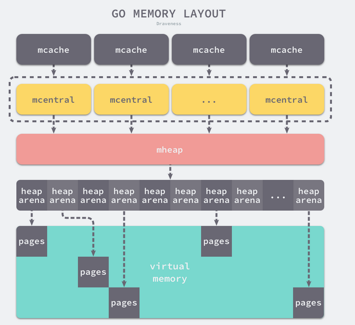
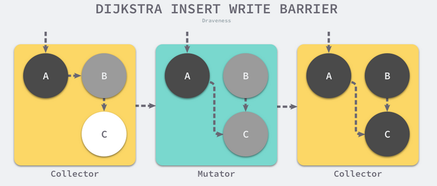
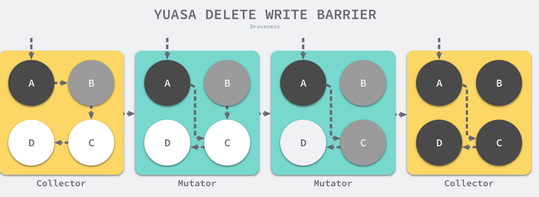

#基础知识
## 数组
如果数组中元素的个数小于或者等于 4 个，那么所有的变量会直接在栈上初始化，如果数组元素大于 4 个，变量就会在静态存储区初始化然后拷贝到栈上
```go
// 栈上初始化
var arr [3]int
arr[0] = 1
arr[1] = 2
arr[2] = 3

// 静态存储区初始化
var arr [5]int
statictmp_0[0] = 1
statictmp_0[1] = 2
statictmp_0[2] = 3
statictmp_0[3] = 4
statictmp_0[4] = 5
arr = statictmp_0
```

数组结构：指向数组开头的指针， 元素的数量， 元素类型的大小。
对数组的访问和赋值需要同时依赖编译器（使用整数和常量）和运行时（变量下标访问），它的大多数操作在编译期间都会转换成直接读写内存，在中间代码生成期间，编译器还会插入运行时方法 runtime.panicIndex 调用防止发生越界错误。

## 切片
切片引入了一个抽象层，提供了对数组中部分连续片段的引用，而作为数组的引用，我们可以在运行区间可以修改它的长度和范围。当切片底层的数组长度不足时就会触发扩容，切片指向的数组可能会发生变化，不过在上层看来切片是没有变化的，上层只需要与切片打交道不需要关心数组的变化
当切片发生逃逸或者非常大时，运行时需要 runtime.makeslice 在堆上初始化切片，
- Data 是指向数组的指针;
- Len 是当前切片的长度；
- Cap 是当前切片的容量，即 Data 数组的大小：
```go
type SliceHeader struct {
	Data uintptr
	Len  int
	Cap  int
}
// 初始化
arr[0:3] or slice[0:3]
slice := []int{1, 2, 3}
slice := make([]int, 10)
arr := [3]int{1, 2, 3}
slice := arr[0:2]
slice1 := arr[0:2]
slice1[0] = 5
fmt.Println(slice, slice1)
//输出都是5 2
```
切片扩容：还需要根据切片中的元素大小对齐内存，当数组中元素所占的字节大小为 1、8 或者 2 的倍数时，runtime.roundupsize 函数会将待申请的内存向上取整，取整时会使用 runtime.class_to_size 数组
- 如果期望容量大于当前容量的两倍就会使用期望容量；
- 如果当前切片的长度小于 1024 就会将容量翻倍；
- 如果当前切片的长度大于 1024 就会每次增加 25% 的容量，直到新容量大于期望容量
```go
var arr []int64
arr = append(arr, 1, 2, 3, 4, 5)
// 执行上述代码时，会触发 runtime.growslice 函数扩容 arr 切片并传入期望的新容量 5，这时期望分配的内存大小为 40 字节；
//不过因为切片中的元素大小等于 sys.PtrSize，所以运行时会调用 runtime.roundupsize 向上取整内存的大小到 48 字节，所以新切片的容量为 48 / 8 = 6。
```

## 哈希map--一般编程语言都会采用拉链法实现
- count 表示当前哈希表中的元素数量；
- B 表示当前哈希表持有的 buckets 数量
- oldbuckets 是哈希在扩容时用于保存之前 buckets 的字段，它的大小是当前 buckets 的一半

runtime.hmap 的桶是 runtime.bmap。每一个 runtime.bmap 都能存储 8 个键值对，当哈希表中存储的数据过多，
单个桶已经装满时就会使用 extra.nextOverflow 中桶存储溢出的数据。
bmap包含 tophash 字段，tophash 存储了键的哈希的高 8 位，通过比较不同键的哈希的高 8 位可以减少访问键值对次数以提高性能, 桶的序号时低位控制的
```go
type hmap struct {
	count     int
	flags     uint8
	B         uint8
	noverflow uint16
	hash0     uint32

	buckets    unsafe.Pointer
	oldbuckets unsafe.Pointer
	nevacuate  uintptr

	extra *mapextra
}

type mapextra struct {
	overflow    *[]*bmap
	oldoverflow *[]*bmap
	nextOverflow *bmap
}

type bmap struct {
    tophash [bucketCnt]uint8
}
```
哈希表扩容机制
- 等量扩容：如果扩容是溢出的桶太多导致的，那么这次扩容就是等量扩容 sameSizeGrow，sameSizeGrow 是一种特殊情况下发生的扩容，当我们持续向哈希中插入数据并将它们全部删除时，如果哈希表中的数据量没有超过阈值，就会不断积累溢出桶造成缓慢的内存泄漏
- 翻倍扩容：就是正常扩容，在扩容期间访问哈希表时会使用旧桶，向哈希表写入数据时会触发旧桶元素的分流（原本3号桶的数据会分流到3，7桶）

Go 语言使用拉链法来解决哈希碰撞的问题实现了哈希表，它的访问、写入和删除等操作都在编译期间转换成了运行时的函数或者方法。哈希在每一个桶中存储键对应哈希的前 8 位，当对哈希进行操作时，这些 tophash 就成为可以帮助哈希快速遍历桶中元素的缓存。

哈希表的每个桶都只能存储 8 个键值对，一旦当前哈希的某个桶超出 8 个，新的键值对就会存储到哈希的溢出桶中。随着键值对数量的增加，溢出桶的数量和哈希的装载因子也会逐渐升高，超过一定范围就会触发扩容，扩容会将桶的数量翻倍，元素再分配的过程也是在调用写操作时增量进行的，不会造成性能的瞬时巨大抖动。

## 字符串
与切片的结构体相比，字符串只少了一个表示容量的 Cap 字段， 字符串是一个只读的类型， 所有在字符串上的写入操作都是通过拷贝实现的

# 常用关键字
## for-range
对于所有的 range 循环，Go 语言都会在编译期将原切片或者数组赋值给一个新变量 ha，在赋值的过程中就发生了拷贝，而我们又通过 len 关键字预先获取了切片的长度，所以在循环中追加新的元素也不会改变循环执行的次数
而遇到这种同时遍历索引和元素的 range 循环时，Go 语言会额外创建一个新的 v2 变量存储切片中的元素，循环中使用的这个变量 v2 会在每一次迭代被重新赋值而覆盖，赋值时也会触发拷贝
```go
func main() {
	arr := []int{1, 2, 3}
	newArr := []*int{}
	for _, v := range arr {
		newArr = append(newArr, &v)
        //newArr = append(newArr, &arr[i])
		
	}
	for _, v := range newArr {
		fmt.Println(*v)
	}
}

$ go run main.go
3 3 3
```

## Select
select 结构的执行过程与实现原理
- 空的 select 语句会被转换成调用 runtime.block 直接挂起当前 Goroutine；
- 如果 select 语句中只包含一个 case，编译器会将其转换成 if ch == nil { block }; n; 表达式；
  - 首先判断操作的 Channel 是不是空的；
  - 然后执行 case 结构中的内容；
- 如果 select 语句中只包含两个 case 并且其中一个是 default，那么会使用 runtime.selectnbrecv 和 runtime.selectnbsend 非阻塞地执行收发操作； 在默认情况下会通过 runtime.selectgo 获取执行 case 的索引，并通过多个 if 语句执行对应 case 中的代码； 

在编译器已经对 select 语句进行优化之后，Go 语言会在运行时执行编译期间展开的 runtime.selectgo 函数，该函数会按照以下的流程执行：
- 随机生成一个遍历的轮询顺序 pollOrder 并根据 Channel 地址生成锁定顺序 lockOrder；
  - 轮询顺序：通过 runtime.fastrandn 函数引入随机性,可以避免 Channel 的饥饿问题，保证公平性
  - 加锁顺序：按照 Channel 的地址排序后确定加锁顺序, 能够避免死锁的发生
- 根据 pollOrder 遍历所有的 case 查看是否有可以立刻处理的 Channel；
  - 如果存在，直接获取 case 对应的索引并返回；
  - 如果不存在，创建 runtime.sudog 结构体，将当前 Goroutine 加入到所有相关 Channel 的收发队列，并调用 runtime.gopark 挂起当前 Goroutine 等待调度器的唤醒；
- 当调度器唤醒当前 Goroutine 时，会再次按照 lockOrder 遍历所有的 case，从中查找需要被处理的 runtime.sudog 对应的索引

## defer
- 堆上分配内存
  - 编译器会将defer关键字转换成deferproc，并在函数返回调用前插入derferreturn
  - deferproc会将一个defer结构体追加到当前goroutine的链表上
  - derferreturn会从goroutine的链表中取出runtime结构体并依次执行
- 栈上分配
  - 当该关键字在函数体中最多执行一次时，会将结构体分配到栈上并调用 runtime.deferprocStack；
- 开放编码 
  - 编译期间判断 defer 关键字、return 语句的个数确定是否开启开放编码优化；defer数量小于8， defer * return < 15
后调用的 defer 函数会先执行:
  - 后调用的 defer 函数会被追加到 Goroutine _defer 链表的最前面；
  - 运行 runtime._defer 时是从前到后依次执行
函数的参数会被预先计算
  - 调用 runtime.deferproc 函数创建新的延迟调用时就会立刻拷贝函数的参数，函数的参数不会等到真正执行时计算；

## panic and recover
panic 能够改变程序的控制流，调用 panic 后会立刻停止执行当前函数的剩余代码，并在当前 Goroutine 中递归执行调用方的 defer；
recover 可以中止 panic 造成的程序崩溃。它是一个只能在 defer 中发挥作用的函数，在其他作用域中调用不会发挥作用；
- panic 只会触发当前 Goroutine 的 defer
- recover 只有在 defer 中调用才会生效；
- panic 允许在 defer 中嵌套多次调用；

## make and new
make 的作用是初始化内置的数据结构，切片、哈希表和 Channel；
new 的作用是根据传入的类型分配一片内存空间并返回指向这片内存空间的指针；


# 并发编程
## channel 实现
channel内部（缓冲区）使用使用循环队列构建， 记录发送接收操作的位置
- qcount — Channel 中的元素个数；
- dataqsiz — Channel 中的循环队列的长度；
- buf — Channel 的缓冲区数据指针；
- sendx — Channel 的发送操作处理到的位置
- recvx — Channel 的接收操作处理到的位置；
sendq 和 recvq 存储了当前 Channel 由于缓冲区空间不足而阻塞的 Goroutine 列表， 数据结构为使用双向链表。

```go
type hchan struct {
qcount   uint
dataqsiz uint
buf      unsafe.Pointer
elemsize uint16
closed   uint32
elemtype *_type
sendx    uint
recvx    uint
recvq    waitq
sendq    waitq
}
```
发送数据
- 如果当前 Channel 的 recvq 上存在已经被阻塞的 Goroutine，那么会直接将数据发送给当前 Goroutine 并将其设置成下一个运行的 Goroutine；
- 如果 Channel 存在缓冲区并且其中还有空闲的容量，我们会直接将数据存储到缓冲区 sendx 所在的位置上，
- 如果不满足上面的两种情况，会创建一个 runtime.sudog 结构并将其加入 Channel 的 sendq 队列中，当前 Goroutine 也会陷入阻塞等待其他的协程从 Channel 接收数据； 

触发调度的时机
- 发送数据时发现 Channel 上存在等待接收数据的 Goroutine，立刻设置处理器的 runnext 属性，但是并不会立刻触发调度，等到下一次调度唤醒数据接收方
- 发送数据时并没有找到接收方并且缓冲区已经满了，这时会将自己加入 Channel 的 sendq 队列， 让出处理器的使用权

接收数据
- 如果 Channel 为空，那么会直接调用 runtime.gopark 挂起当前 Goroutine
- 如果 Channel 已经关闭并且缓冲区没有任何数据，runtime.chanrecv 会直接返回；
- 如果 Channel 的 sendq 队列中存在挂起的 Goroutine，会将 recvx 索引所在的数据拷贝到接收变量所在的内存空间上并将 sendq 队列中 Goroutine 的数据拷贝到缓冲区；
- 如果 Channel 的缓冲区中包含数据，那么直接读取 recvx 索引对应的数据；
- 在默认情况下会挂起当前的 Goroutine，将 runtime.sudog 结构加入 recvq 队列并陷入休眠等待调度器的唤醒

触发调度的时机
- 当 Channel 为空时
- 当缓冲区中不存在数据并且也不存在数据的发送者时；

# 锁-同步原语
## sync.Mutex 
总共占8字节， 低三位分别表示 mutexLocked（锁状态）、mutexWoken（正常） 和 mutexStarving（饥饿），剩下的位置用来表示当前有多少个 Goroutine 在等待互斥锁的释放

饥饿模式是保证互斥锁的公平性， 互斥锁会直接交给等待队列最前面的 Goroutine。新的 Goroutine 在该状态下不能获取锁、也不会进入自旋状态，它们只会在队列的末尾等待
如果一个 Goroutine 获得了互斥锁并且它在队列的末尾或者它等待的时间少于 1ms，那么当前的互斥锁就会切换回正常模式
```go
type Mutex struct {
	state int32
	sema  uint32
}
```

## sync.RWMutex
```go
type RWMutex struct {
	w           Mutex 复用互斥锁提供的能力；
	writerSem   uint32 分别用于写等待读和读等待写：
	readerSem   uint32 
	readerCount int32 存储了当前正在执行的读操作数量；
	readerWait  int32 表示当写操作被阻塞时等待的读操作个数；
}
```
写锁的获取 
- 调用结构体持有的 sync.Mutex 结构体的 sync.Mutex.Lock 阻塞后续的写操作
  - 因为互斥锁已经被获取，其他 Goroutine 在获取写锁时会进入自旋或者休眠；
- 调用 sync/atomic.AddInt32 函数阻塞后续的读操作
- 如果仍然有其他 Goroutine 持有互斥锁的读锁， 该 Goroutine会进入休眠状态等待所有读锁所有者执行结束后释放 writerSem 信号量将当前协程唤醒；

写锁的释放
- 调用 sync/atomic.AddInt32 函数将 readerCount 变回正数，释放读锁
- 通过 for 循环释放所有因为获取读锁而陷入等待的 Goroutine：
- 调用 sync.Mutex.Unlock 释放写锁；

读锁的获取
sync.RWMutex.RLock该方法会通过 sync/atomic.AddInt32 将 readerCount 加一
- 如果该方法返回负数 — 其他 Goroutine 获得了写锁， 陷入休眠，等待其他所的释放
- 如果该方法的结果为非负数 — 没有 Goroutine 获得写锁，当前方法会成功返回

读锁的释放
调用sync.RWMutex.RUnlock方法， 减少正在读资源的 readerCount 整数
- 如果返回值大于等于零 — 读锁直接解锁成功；
- 如果返回值小于零 — 有一个正在执行的写操作（写操作会将readerCount置为0， 完成后会恢复），在这时会调用sync.RWMutex.rUnlockSlow 方法；减少获取锁的写操作等待的读操作数 readerWait 并在所有读操作都被释放之后触发写操作的信号量 writerSem，该信号量被触发时，调度器就会唤醒尝试获取写锁的 Goroutine。

## sync.WaitGroup
可以等待一组 Goroutine 的返回，一个比较常见的使用场景是批量发出 RPC 或者 HTTP 请求：

## sync.Once 
可以保证在 Go 程序运行期间的某段代码只会执行一次。通过成员变量 done(初始为0，执行一次过后变为1) 确保函数不会执行第二次
```go
type Once struct {
	done uint32
	m    Mutex
}
```

## sync.Cond
可以让一组的 Goroutine 都在满足特定条件时被唤醒。每一个 sync.Cond 结构体在初始化时都需要传入一个互斥锁

- 10 个 Goroutine 通过 sync.Cond.Wait 等待特定条件的满足；
- 1 个 Goroutine 会调用 sync.Cond.Broadcast 唤醒所有陷入等待的 Goroutine；
- 调用 sync.Cond.Broadcast 方法后，上述代码会打印出 10 次 “listen” 并结束调用。
```go
var status int64

func main() {
	c := sync.NewCond(&sync.Mutex{})
	for i := 0; i < 10; i++ {
		go listen(c)
	}
	time.Sleep(1 * time.Second)
	go broadcast(c)

	ch := make(chan os.Signal, 1)
	signal.Notify(ch, os.Interrupt)
	<-ch
}

func broadcast(c *sync.Cond) {
	c.L.Lock()
	atomic.StoreInt64(&status, 1)
	c.Broadcast()
	c.L.Unlock()
}

func listen(c *sync.Cond) {
	c.L.Lock()
	for atomic.LoadInt64(&status) != 1 {
		c.Wait()
	}
	fmt.Println("listen")
	c.L.Unlock()
}

$ go run main.go
listen
...
listen
```

Cond数据结构
```go
type Cond struct {
	noCopy  noCopy
	L       Locker
	notify  notifyList // 维护等待的goroutine， 是一个链表
	checker copyChecker
}
```
sync.Cond.Wait 方法会将当前 Goroutine 陷入休眠状态， 将链表加入到链表末端。
sync.Cond.Signal 方法会唤醒队列最前面的 Goroutine；
sync.Cond.Broadcast 方法会唤醒队列中全部的 Goroutine；

# 内存分配器
程序中的数据和变量都会被分配到程序所在的虚拟内存中，内存空间包含两个重要区域：栈区（Stack）和堆区。 
函数调用的参数、返回值以及局部变量大都会被分配到栈上，这部分内存会由编译器进行管理
堆中的对象由内存分配器分配并由垃圾收集器回收。
当用户程序申请内存时，它会通过内存分配器申请新内存，而分配器会负责从堆中初始化相应的内存区域

## 分配方法
隔离适应： 将内存分割成多个链表，每个链表中的内存块大小相同，申请内存时先找到满足条件的链表，再从链表中选择合适的内存块；
- 隔离适应的分配策略减少了需要遍历的内存块数量，提高了内存分配的效率

go语言使用分级分配， 核心理念是使用多级缓存将对象根据大小分类，并按照类别实施不同的分配策略。
根据对象的大小分成为微对象（0-16B）， 小对象（16kb-32kb）， 大对象（32kb-）， 同时将内存分为不同的级别管理：线程缓存（Thread Cache）、中心缓存（Central Cache）和页堆（Page Heap）三个组件分级管理内存。

 ## 虚拟内存
1.0版本的go堆区的内存是线性的，但是c和go会和使用时会导致程序崩溃
- 分配的内存地址会发生冲突，导致堆的初始化和扩容失败
- 没有被预留的大块内存可能会被分配给 C 语言的二进制，导致扩容后的堆不连续

1.1版本go使用二维稀疏内存， 每个单元都会管理 64MB 的内存空间

## 内存管理组件
每一个处理器都会分配一个线程缓存 runtime.mcache 用于处理微对象和小对象的分配，它们会持有内存管理单元 runtime.mspan
runtime.mspan是一个双向链表， 包含 next 和 prev 两个字段，它们分别指向了前一个和后一个 runtime.mspan


# 垃圾收集器
## 三色标记法

- 白色：潜在的垃圾，其内存可能会被垃圾收集器回收
- 黑色：活跃的对象，包括不存在任何引用外部指针的对象以及从根对象可达的对象；
- 灰色：活跃的对象，因为存在指向白色对象的外部指针，垃圾收集器会扫描这些对象的子对象；

初始化阶段，不存在任何的黑色对象，垃圾收集器的根对象会被标记成灰色， 当灰色集合中不存在任何对象时， 标记阶段结束。
- 从灰色对象的集合中选择一个灰色对象并将其标记成黑色
- 将黑色对象指向的所有对象都标记成灰色，保证该对象和被该对象引用的对象都不会被回收；
- 重复上述两个步骤直到对象图中不存在灰色对象；

用户程序可能在标记执行的过程中修改对象的指针(导致被回收的对象被用引用)，所以三色标记清除算法本身是不可以并发或者增量执行的,
仍然需要 STW

## 屏障技术
内存屏障技术是一种屏障指令，它可以让 CPU 或者编译器在执行内存相关操作时遵循特定的约束，目前多数的现代处理器都会乱序执行指令以最大化性能。
但是该技术能够保证内存操作的顺序性，在内存屏障前执行的操作一定会先于内存屏障后执行的操作

想要在并发或者增量的标记算法中保证正确性，我们需要达成以下任何一种三色不变性
- 强三色不变性 — 黑色对象不会指向白色对象，只会指向灰色对象或者黑色对象；
- 弱三色不变性 — 黑色对象指向的白色对象必须包含一条从灰色对象经由多个白色对象的可达路径

### 插入写屏障-强三色不变性
每当执行类似 *slot = ptr 的表达式时，如果 ptr 指针是白色的，那么会将该对象设置成灰色
- 垃圾收集器将根对象指向 A 对象标记成黑色并将 A 对象指向的对象 B 标记成灰色
- 用户程序修改 A 对象的指针，将原本指向 B 对象的指针指向 C 对象，这时触发写屏障将 C 对象标记成灰色；
- 垃圾收集器依次遍历程序中的其他灰色对象，将它们分别标记成黑色；

标记阶段完成时暂停程序、将所有栈对象标记为灰色并重新扫描（根对象包括栈，全局变量）


### 删除写屏障-弱三色不变性
在老对象的引用被删除时，将白色的老对象涂成灰色，这样删除写屏障就可以保证弱三色不变性
- 垃圾收集器将根对象指向 A 对象标记成黑色并将 A 对象指向的对象 B 标记成灰色
- 用户程序将 A 对象原本指向 B 的指针指向 C，触发删除写屏障，但是因为 B 对象已经是灰色的，所以不做改变；
- 用户程序将 B 对象原本指向 C 的指针删除，触发删除写屏障，白色的 C 对象被涂成灰色
- 垃圾收集器依次遍历程序中的其他灰色对象，将它们分别标记成黑色；


### 混合写屏障
将被覆盖的对象标记成灰色并在当前栈没有扫描时将新对象也标记成灰色。

为了移除栈的重扫描过程，除了引入混合写屏障之外，在垃圾收集的标记阶段，我们还需要将创建的所有新对象都标记成黑色，
防止新分配的栈内存和堆内存中的对象被错误地回收，因为栈内存在标记阶段最终都会变为黑色，所以不再需要重新扫描栈空间

插入写屏障会带来大量的额外开销，所以在实现上没有对栈上的对象开启，在扫描结束后会对栈上对象重新扫描；
混合写屏障虽然不存在重新扫描的需要，但是它会带来比较多的冗余标记操作。
结合两者可以避免栈的重扫，也可以减少一部分冗余的扫描和标记操作。

### 增量与并发
- 增量收集器：将原本时间较长的暂停时间切分成多个更小的 GC 时间片（需要三色标记法和写屏障）。
虽然增量式的垃圾收集能够减少最大的程序暂停时间，但是增量式收集也会增加一次 GC 循环的总时间（增量式的垃圾回收一定会引入额外开销（写屏障），所以一次 GC 的总时间会大于 STW GC 的时间）
- 并发收集器：不仅能够减少程序的最长暂停时间，还能减少整个垃圾收集阶段的时间，通过开启读写屏障、利用多核优势与用户程序并行执行

### 触发垃圾收集
- 手动触发： 通过 runtime.GC 函数在程序运行期间主动通知运行时执行，该方法在调用时会阻塞调用方直到当前垃圾收集循环完成，在垃圾收集期间也可能会通过 STW 暂停整个程序
- 申请内存：当前线程的内存管理单元中不存在空闲空间时，创建微对象和小对象需要调用 runtime.mcache.nextFree 从中心缓存或者页堆中获取新的管理单元，在这时就可能触发垃圾收集
。当用户程序申请分配 32KB 以上的大对象时，一定会构建 runtime.gcTrigger 结构体尝试触发垃圾收集；
- 后台触发：运行时会在应用程序启动时在后台开启一个用于强制触发垃圾收集的 Goroutine。

