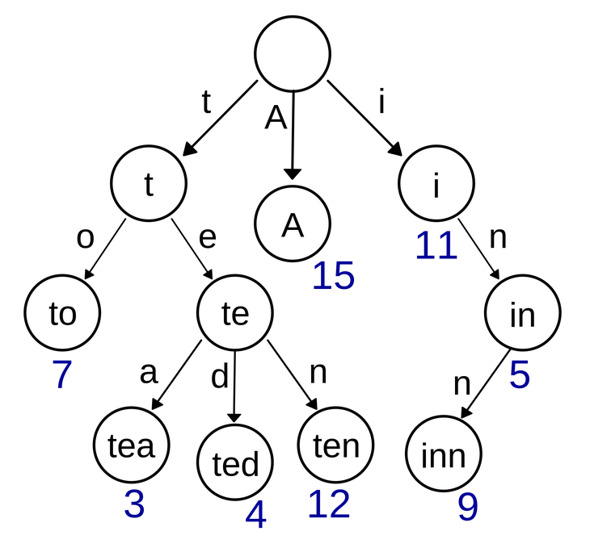
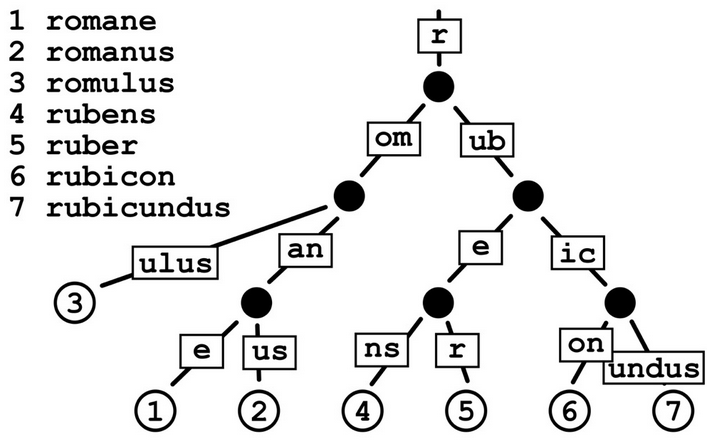

# Go-Problem
一些Go的相关问题

## Go-sync.map
Go原生map不是并发安全的， 要保证map的并发安全需要加锁， 然而这个锁是粗粒度的，消耗性能

解决思路：1.空间换时间， 2.降低锁的影响范围

sync.map: 采用读写分离的策略， 添加缓存read，原始数据存在dirty， 降低锁时间来提高效率； 缺点：不适用于大量写的场景，这样会导致read map读不到数据而进一步加锁读取，同时dirty map也会一直晋升为read map，整体性能较差。 适用场景：大量读，少量写
写操作：直接写入dirty， 读：先读read， read没有再读dirty


### 数据结构
```go
type Map struct {
	mu Mutex // 保护dirty字段
	read atomic.Value // readOnly相当于缓存
	dirty map[interface{}]*entry //包含最新写入的数据。当misses计数达到一定值，将其赋值给read。
	misses int //技术每次从read读取失败， 计数加一
}
```
### 查询
先去read中读， read中不存在就去dirty中读， 此时miss++， 如果miss>len(dirty)，将dirty赋值给read，将dirty置为nil
- 直接赋值是因为写操作只会操作dirty，所以保证了dirty是最新的，并且数据集是肯定包含read的
- 将diryt置为nil？？要是再经过写操作，dirty赋值给read，然后查询以前的数据那不是丢失了？？？--后面提到会将定期进行dirty的刷新

### 删
在read查找需要删除的元素， 找到将值标记为nil(标记删除)， 否则在dirty中查找， 找到直接删除
- 为什么dirty是直接删除，而read是标记删除？-- read的作用是在dirty前头优先度，遇到相同元素的时候为了不穿透到dirty，所以采用标记的方式。
- 直接删除的成本低， 不需要查找

### 增-改
先取读read， 如果read存在且未被标记为删除， 则尝试更新数据。若read存在，entry被标记expunge，则表明dirty没有key，可添加入dirty，并更新entry
若dirty有key则直接更新。若dirty和read都没有该key， 将该值加入到dirty当中。（源码还有一次判断， 如果此时read和dirty相同， 触发dirty刷新将read中未删除的数据赋值给dirty）


## Gin框架 路由前缀树
### Trie tree
Trie Tree的原理是将每个key拆分成每个单位长度字符，然后对应到每个分支上，分支所在的节点对应为从根节点到当前节点的拼接出的key的值。它的结构图如下所示。
每条边只存储一个字符。当存储的key带有大量重复的前缀时可以节省大量空间。

查询效率：每次从树根查找， 查询效率为O（m）， 随这key的长度增加， 时间越长， 本质原因时因为树的深度。


### Radix Tree
Radix Tree的计数统计原理和Trie Tree极为相似，一个最大的区别点在于它不是按照每个字符长度做节点拆分，而是可以以1个或多个字符叠加作为一个分支。这就避免了长字符key会分出深度很深的节点。Radix Tree的结构构造如下图所示：
本质就是减少树的深度


