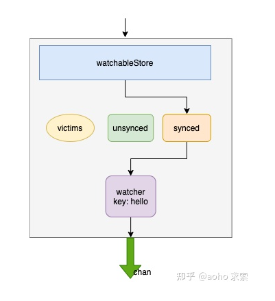

## Etcd-Watcher
watchableStore 收到了所有 key 的变更后，将这些 key 交给 synced（watchGroup），synced 能够快速地从所有 key 中找到监听的 key。将这些 key 发送给对应的 watcher，这些 watcher 再通过 chan 将变更信息发送出去。
当发送消息的channel被占满时， 会将这些变更事件发送到victims， 等待关联的channel有空闲位置

watchableStore 会启动两个groutine， watchable Store. sync WatchersLoop方法， 是每隔 IOOms unsynced watcherGroup 进行一次批量的同步
syncVictims Loop（）方法会定期处理 watchableStore.victims 缓存 watcherBatch实例。

当个key的监听使用map实现， 一组key的监听使用红黑树实现

## Boltdb如何实现事务---舍弃了并发写的功能
写的时候-写锁
读的时候-读写锁
首先boltdb使用了mmap技术, 不支持写写并发， 支持一写多读。 读写事务对数据的变更都在内存中， 而只读事务是直接读取的磁盘上面的内容，
因此读写事务的改动不会为只读事务所见。多个读写事务是串行的，也不会互相影响。而每个只读事务期间所看到的状态，就是该只读事务开始执行时的状态。